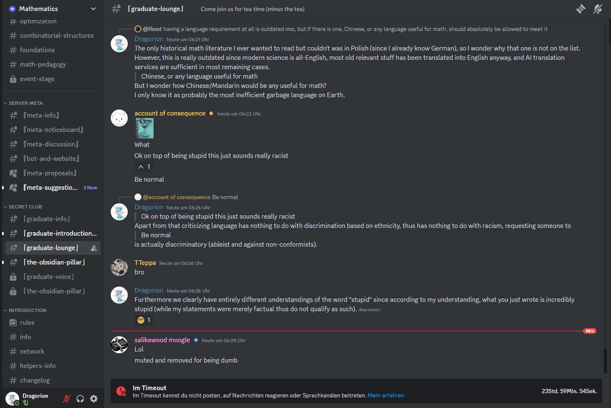
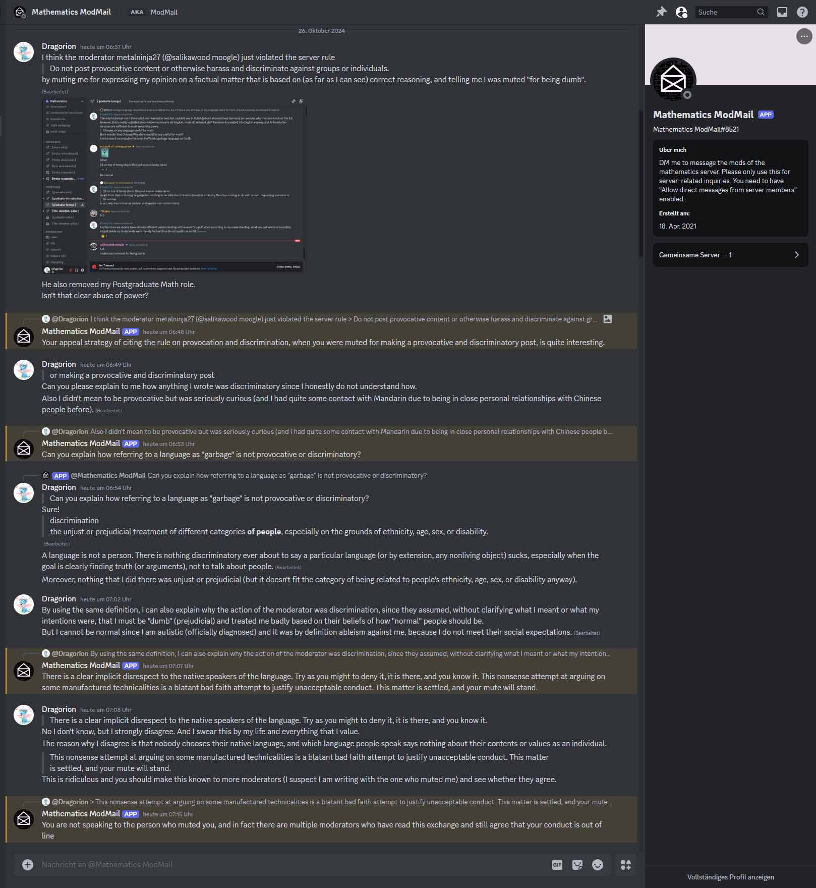

# How to be punished for voicing cultural opinions …

**… in large scientific communities?**

Easy.

Or: Are we witnessing the downfall of society, which explains the Fermi paradox?

The [woke mind virus](https://knowyourmeme.com/memes/woke-mind-virus) has apparently infected large parts of academia, up to a point where *mathematicians* (or people posing as such) believe it to be “out of line” and discriminatory behavior **when someone voices their distaste for specific cultural aspects such as the inefficiency of Chinese language**, and they **punish authors of such comments**.

### Am I kidding or exaggerating? I wish.

On [Mathematics](https://mathematics.gg/), the **largest mathematics-related Discord server** — and an **Official Discord Partner** with [over 230000 members at the time](img/Join-2024-10-27-02.58.20.jpg) — multiple moderators agreed that *restricting channel access privileges* and *a temporary mute* would make an appropriate punishment for someone **expressing an aversion to Chinese language with respect to efficiency**.  
The moderation team unironically argued that expressing such opinions would discriminate against native speakers of the language and turned a blind eye to the “`muted and removed for being dumb`” message by the executing moderator, which in fact admitted discrimination against the accused mathematician.

Despite the latter pointing out these issues and refuting the moderator's concerns via
> nobody chooses their native language, and which language people speak says nothing about their contents or values as an individual

the moderation team stood by their decision and uttered:  
> This nonsense attempt at arguing on some manufactured technicalities is a blatant bad faith attempt to justify unacceptable conduct. This matter is settled, and your mute will stand.

The perpetrator™ swore they had no bad intentions and mentioned to be autistic.  
But to the moderation team of “[Mathcord](https://mathematics.gg/)”, one is guilty ~~until proven innocent~~ *no matter what*.

### Evidence

1. *Discriminatory hate crime*™ against native speakers of Mandarin:
   
   These were notably the first messages of the user in this channel, which to access requires a `Postgraduate Math` role that comes with a verification process. This role was taken away from the perpetrator™ due to this incident.
2. Irrefutable™ and intelligent™ logical™ reasoning of the moderation team:
     
   (Several envelope emotes were removed for readability. [[original](img/woke-idiots-mathcord.jpg)])

### What is “wokeness”?

Roughly speaking, wokeness is the belief that in order to compensate for perceived injustices, there need to be new injustices but in opposite directions. Corresponding behavior is instilled into individuals in amounts that I find alarming and capable of destroying our liberal Western society. The movie [Idiocracy](https://www.imdb.com/title/tt0387808/) comes to mind.

Woke people are usually victims of [groupthink](https://en.wikipedia.org/wiki/Groupthink) and imbecilic in many ways. But let me be clear: To be conformist or stupid is fine. As long as there is no hate or discrimination against non-conformists or non-stupid people, at which point it becomes really dangerous.

### Why do I share this?

What I find even more alarming is that seemingly *all* communities — no matter as how intellectual and prestigious they are generally perceived — contain significant amounts of individuals that act in or defend such disastrous hypocritical ways while being entirely unaware that they show equivalent behaviors of which they (often falsely) accuse others. Based on their own discriminatory beliefs, they tend to try to prohibit behaviors only for some kinds of individuals. They remain unaware of the fact that they provide ideal grounds for violent conflicts and dystopian horror scenarios, and are immune to being educated from history.

This serves as an example of common idiocy that is very serious. Picking examples such as this one from the mathematics community shows further that often a lack of basic reasoning abilities cannot be cured by educational programs, even if the programs are heavily focussed on logical reasoning abilities.  

When I converse that idiots are essentially everywhere, I am often asked for reasons and examples.  
Despite being a creative mind, I couldn't even make this shit up as something that realistically happens.
